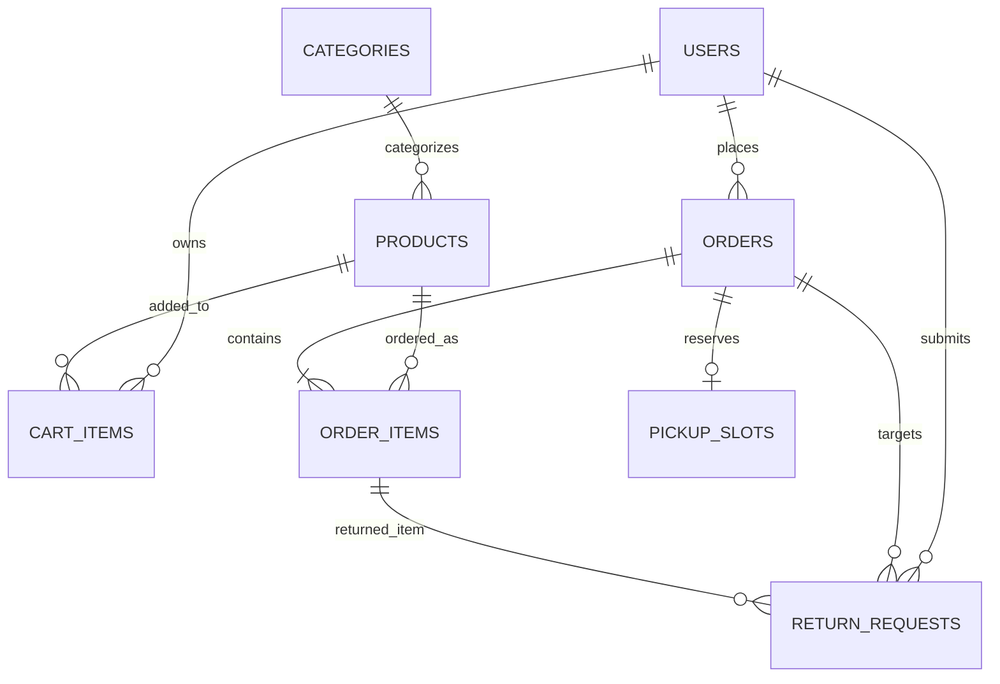

# 🛒 Mini D-Mart — Production-Ready Grocery Store Application

[](https://www.oracle.com/java/)
[](https://spring.io/projects/spring-boot)
[](https://reactjs.org/)
[](https://www.typescriptlang.org/)
[](https://tailwindcss.com/)
[](https://www.docker.com/)

---

## 📌 1. Project Overview & Assessment Objective
**Mini D-Mart** is a full-featured, production-ready full-stack grocery store web application designed and built for the **Round 2 Practical Assessment**. 

Going far beyond a basic CRUD demo, Mini D-Mart delivers an enterprise-grade omnichannel grocery experience:
- **Customers** can browse 30+ categorized grocery products, manage carts, choose between **Express Store Pickup** (with scheduled time slots & 6-digit verification OTP) or **Doorstep Home Delivery**, track live order progress on an interactive timeline, and initiate return/exchange requests with automated eligibility validation.
- **Store Staff** have a dedicated **Operations Console** featuring a live **Order Preparation Queue (KOT packing slip style)**, one-click order progression, a **Store Pickup OTP Verification Tool**, and a **Returns Inspection Hub**.
- **Managers & Administrators** have access to executive analytics KPIs (revenue, order volume, return rate), inventory stock control with instant restock and low-stock alerts, pickup slot capacity configuration, user RBAC privilege management, and tamper-evident audit logging.

Live Link :- https://onemart-h2js.onrender.com
---

## 🏗️ 2. Architecture & Tech Stack

```
+-----------------------------------------------------------------------------------+
|                                Mini D-Mart System                                 |
+-----------------------------------------------------------------------------------+
|                                                                                   |
|  [ FRONTEND - React 18 + TypeScript + Vite + Tailwind CSS + Lucide Icons ]        |
|  ├── Customer Portal: Catalog, Live Search, Cart Drawer, Slot Picker, Live Orders |
|  ├── Staff Portal   : Packing Queue, Counter OTP Verify, Returns Inspection       |
|  ├── Manager Portal : KPI Analytics, Inventory Master, Slot Capacity Manager      |
|  └── Admin Portal   : User RBAC Roles, System Settings, Audit Logs Stream         |
|                                     │                                             |
|                                REST / HTTPS                                       |
|                                     ▼                                             |
|  [ BACKEND - Spring Boot 3/4 + Java 21 + Spring Security + OAuth2 JWT ]           |
|  ├── Security Layer : Stateless Bearer JWT (HS256 256-bit), RBAC Method Security  |
|  ├── Business Logic : Stock Locking, Slot Capacity Gate, Return Eligibility Engine|
|  ├── Data Storage   : Spring Data JPA / Hibernate ORM                             |
|  └── API Docs       : Springdoc OpenAPI 3.0 (Swagger UI at /swagger-ui.html)      |
|                                     │                                             |
|                                JDBC / SQL                                         |
|                                     ▼                                             |
|  [ DATABASE LAYER ]                                                               |
|  ├── Production DB  : PostgreSQL 16 (Relational, Indexed, Foreign Key Constraints)|
|  └── Local / Demo DB: In-Memory H2 with Auto-Seeding (Zero configuration run)     |
+-----------------------------------------------------------------------------------+
```

---

## 👥 3. Default System Accounts & Credentials

The system comes pre-initialized with secure default accounts for each role, with passwords strictly hashed using **BCrypt (cost 10)** in the database:

| Role | Default Email | Password | Destination Dashboard / Workspace |
|---|---|---|---|
| **👑 ADMIN** | `admin@minidmart.com` | `Admin@1234` | `/admin` (System control, User RBAC assignment, Audit log streams, Catalog master) |
| **📊 MANAGER** | `manager@minidmart.com` | `Manager@1234` | `/manager` (Sales & revenue KPI dashboard, Stock restock / adjust, Slot capacities) |
| **📦 STAFF** | `staff@minidmart.com` | `Staff@1234` | `/staff` (Live order preparation queue, Pickup Counter 6-Digit OTP verification, Returns inspection) |
| **🛒 CUSTOMER** | `customer@minidmart.com` | `Customer@1234` | `/` (Grocery catalog, Cart drawer, Store Pickup vs Home Delivery, Orders timeline) |

*Upon submitting credentials on the login screen, Spring Security executes real-time password verification via `BCryptPasswordEncoder`, generates a signed 256-bit JWT token, and automatically redirects the user to their designated role portal.*

---

## ⚡ 4. Core Features & Business Logic

### 🛒 A. Shopping & Fulfillment
1. **Dynamic Catalog**: Instant search, category filters (Fruits & Vegetables, Dairy, Staples, Beverages, Household, Personal Care), stock indicators, unit pricing, and discount tags.
2. **Interactive Cart**: Real-time stock limit validation, free delivery progress bar (orders ≥ ₹500 free), dynamic 5% GST calculation.
3. **Store Pickup Flow**:
   - Selection of date & time slot.
   - Slot capacity gate: rejects overbooked slots atomically.
   - Generates a **unique 6-digit pickup verification OTP** (e.g. `748291`).
4. **Home Delivery Flow**: Validates address, city, pincode, contact phone, and delivery instructions.

### 📦 B. Store Operations & Staff Dispatch
1. **Order Preparation Queue**: Packing screen with item checklists and status progression:
   - Delivery: `PLACED` ➔ `CONFIRMED` ➔ `PREPARING` ➔ `OUT_FOR_DELIVERY` ➔ `DELIVERED`
   - Store Pickup: `PLACED` ➔ `CONFIRMED` ➔ `PREPARING` ➔ `READY_FOR_PICKUP` ➔ `PICKED_UP`
2. **Pickup Counter Verification**: Staff enters the customer's 6-digit OTP code to verify and complete handover in real time.
3. **Order Cancellation & Auto-Restock**: Customers can self-cancel before preparation starts; inventory stock and slot capacity are automatically restored.

### 🔄 C. Return & Exchange Engine
1. **Eligibility Engine**:
   - Order must be in `DELIVERED` or `PICKED_UP` status.
   - Request must be within `product.returnWindowDays` (default 7 days).
   - Product must have `isReturnable = true` (perishables excluded).
   - Prevents duplicate return requests on the same order item.
2. **Item Exchange**: Validates replacement product stock before accepting request.
3. **Staff Inspection & Restock**: Staff inspects condition reason (damaged, wrong item, expired) and can approve with automatic inventory restocking or damage write-off.

### 📊 D. Manager & Admin Dashboard
1. **Analytics KPIs**: Live revenue counter, total orders, active queue volume, low-stock alerts count, return rate percentage.
2. **Inventory Master**: Inline stock adjustment modal, SKU tracking, active/disabled toggle.
3. **Pickup Slot Scheduler**: Configure time windows and max order capacity per slot.
4. **User RBAC Management**: Elevate or demote user roles (`CUSTOMER` ➔ `STAFF` ➔ `MANAGER` ➔ `ADMIN`), suspend/activate accounts.
5. **Audit Logs Trail**: Complete tamper-evident record of administrative and security events.

---

## 🗄️ 5. Database Schema



### Table Definitions:
- `users`: `id`, `name`, `email` (unique), `password` (BCrypt), `phone`, `role`, `active`, `created_at`, `updated_at`.
- `categories`: `id`, `name` (unique), `description`, `image_url`, `active`, `created_at`, `updated_at`.
- `products`: `id`, `name`, `description`, `category_id`, `sku` (unique), `barcode`, `image_url`, `unit`, `mrp_price`, `selling_price`, `stock_quantity`, `low_stock_threshold`, `is_returnable`, `return_window_days`, `active`, `created_at`, `updated_at`.
- `cart_items`: `id`, `user_id`, `product_id`, `quantity`, `created_at`, `updated_at`.
- `pickup_slots`: `id`, `slot_date`, `start_time`, `end_time`, `max_capacity`, `booked_count`, `active`.
- `orders`: `id`, `order_number` (unique), `user_id`, `fulfillment_type`, `status`, `subtotal`, `delivery_fee`, `discount_amount`, `tax_amount`, `total_amount`, `payment_method`, `payment_status`, `delivery_address`, `delivery_city`, `delivery_pincode`, `delivery_phone`, `pickup_slot_id`, `pickup_verification_code`, `cancellation_reason`, `placed_at`, `completed_at`, `cancelled_at`.
- `order_items`: `id`, `order_id`, `product_id`, `product_name`, `product_sku`, `unit`, `unit_price`, `quantity`, `subtotal`, `is_returned_or_exchanged`.
- `return_requests`: `id`, `request_number` (unique), `order_id`, `order_item_id`, `user_id`, `type`, `reason`, `details`, `image_evidence_url`, `exchange_product_id`, `status`, `refund_amount`, `staff_review_notes`, `reviewed_by_user_id`, `restock_item`, `created_at`, `updated_at`.
- `audit_logs`: `id`, `action`, `entity_name`, `entity_id`, `user_id`, `user_email`, `role`, `ip_address`, `details`, `timestamp`.

---

## 🚀 6. Setup & Running Locally

### Prerequisites:
- Java 21+
- Node.js 18+ & npm
- (Optional) Docker & Docker Compose

### Option 1: Zero-Config Local Run (Recommended)
1. **Start Backend**:
   ```bash
   # From project root
   ./mvnw spring-boot:run
   ```
   *The backend starts at `http://localhost:8080` with in-memory H2 database, Swagger UI at `http://localhost:8080/swagger-ui.html`, and automatically seeds categories, products, slots, and demo users.*

2. **Start Frontend**:
   ```bash
   cd frontend
   npm install
   npm run dev
   ```
   *Open your browser at `http://localhost:5173`.*

---

### Option 2: Docker Compose (Production Multi-Container)
```bash
docker compose up --build
```
- Frontend: `http://localhost:5173` or `http://localhost`
- Backend API: `http://localhost:8080/api`
- PostgreSQL: `localhost:5432`

---

## 📡 7. REST API Documentation

Interactive Swagger documentation is available at: **`http://localhost:8080/swagger-ui.html`**

### Key Endpoints:
- `POST /api/auth/register` — Customer registration
- `POST /api/auth/login` — Authenticate & obtain JWT
- `GET /api/auth/me` — Current user profile
- `GET /api/categories` — Browse active categories
- `GET /api/products` — Search and filter products (`categoryId`, `query`, `minPrice`, `maxPrice`, `inStockOnly`)
- `GET /api/slots` — Available pickup slots with remaining capacity
- `GET /api/cart` & `POST /api/cart` — Cart management
- `POST /api/orders/customer` — Place store pickup or home delivery order
- `GET /api/orders/customer` — Customer order history and live status
- `POST /api/orders/customer/{id}/cancel` — Cancel order & auto restock
- `GET /api/orders/staff/queue` — Staff preparation queue
- `PATCH /api/orders/staff/{id}/status` — Progress order status
- `POST /api/orders/staff/verify-pickup` — Verify 6-digit pickup OTP
- `GET /api/returns/customer/eligibility` — Check item return eligibility
- `POST /api/returns/customer` — Submit return/exchange request
- `PATCH /api/returns/staff/{id}/review` — Review/approve return request
- `GET /api/analytics/summary` — Executive store performance KPIs
- `GET /api/users` & `PATCH /api/users/{id}/role` — Admin user RBAC control
- `GET /api/admin/audit-logs` — Security & operational audit trail

---

## 🧪 8. Automated Testing & Verification
Execute the test suite covering authentication, stock deduction, slot capacity reservation, and return eligibility:
```bash
./mvnw test
```

---

## 🤖 9. AI Usage Disclosure
This project was developed with assistance from Google DeepMind's Antigravity AI coding assistant to accelerate architectural scaffolding, component design, and test coverage while strictly adhering to production software engineering best practices.
